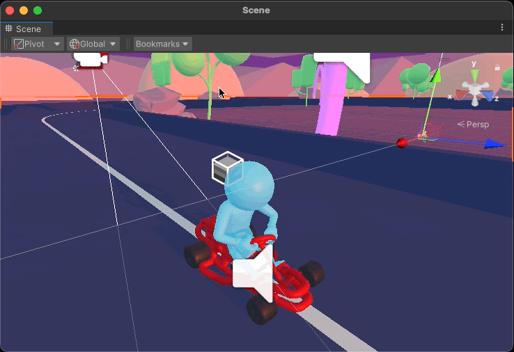
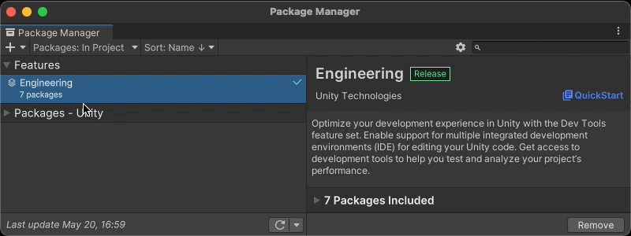

# Scene View Bookmarks

Unity editor extension that adds scene view bookmarks, allowing you to quickly
return the scene camera to preset positions.

Inspired by [camera bookmarks](https://www.youtube.com/watch?v=_i-d5OZmhWI) in
Unreal Engine.

## Requirements

Unity 2019.4 or later. The scene overlay only appears in 2021.2 and up.

## Installing

1. Open *Window > Package Manager*
2. Click the + button in the top-left corner
3. Choose "Add package from git URL..."
4. Enter https://github.com/mminer/scene-view-bookmarks.git

## Using

Choose *Window > Scene View Bookmarks > Set Bookmark 1* to save the scene
camera's current position. When you want to return to the view that you
bookmarked, choose *Window > Move to Bookmark 1*.

For faster access press <kbd>option / alt</kbd> <kbd>1</kbd> to save a bookmark
then <kbd>shift</kbd> <kbd>1</kbd> to return to it.

After recalling a bookmark, restore the former scene view using *Window > Scene
View Bookmarks > Return to Previous View* or by pressing <kbd>shift</kbd>
<kbd>0</kbd>. Think of this as an undo of sorts.

### Scene Overlays

If you use 2021.2 or later you can access bookmarks from a dropdown in the Scene
window. Click the ⋮ button in the top-right of the window and choose *Overlays >
Scene View Bookmarks*.

### Search

Use the `svb:` filter in Unity's built-in Search window for yet another way to
access bookmarks.
